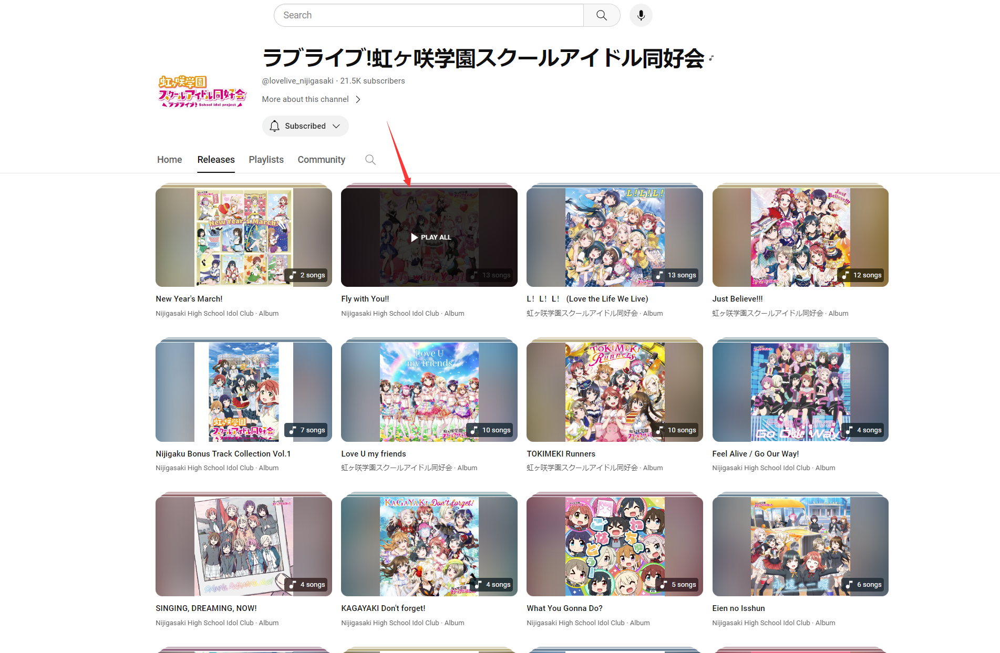
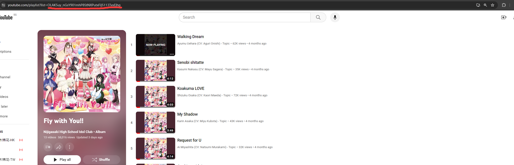

# 爬虫获取youtube的playlist信息
## 如何使用
- 首先需要挂一个香港（HK）节点
- 然后获取playlist的id
  以虹咲五专《Fly with You!!》为例，首先点击进入列表中
    

  然后点击右上的专辑名进入播放列表
    

  然后list=后面的部分就是需要的playlist_id了
    
- 然后传入主函数的crawl_for_youtube_playlist(playlist_id)中
- 最后结果就存到result.txt中了，默认是按照播放量降序排序
